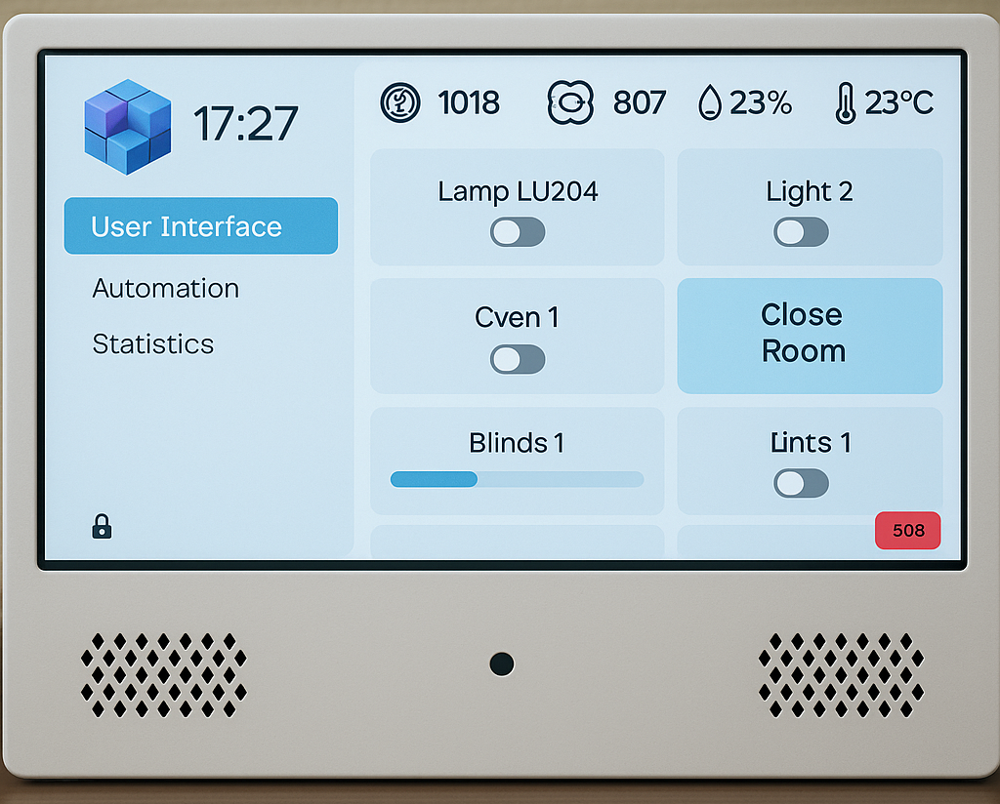

# SmartCab

SmartCab is a comprehensive **smart classroom system** designed to make school classrooms safer, more efficient, and more comfortable.  
At its core is a **hub device** (based on Raspberry Pi with touchscreen) that serves as a central interface for teachers and students.

## Features

- **User Interface**  
  Intuitive tab-based interface with PIN/NFC access for private sections.

- **Environment Monitoring**  
  Real-time tracking of temperature, humidity, CO₂ levels and more, with alerts when values exceed safe limits.

- **Smart Classroom Control**  
  - Manage lights, smart plugs, blinds, and computers.  
  - Remote and mass control via Zigbee, SSH, and Wake-on-WiFi.

- **Automation**  
  Custom scenarios and schedules (e.g., “end of day” routine: turn off lights, shut down computers, close blinds).

- **Statistics & Analytics**  
  - Environment data logs with graphs.  
  - Lesson feedback collection from students, stored and visualized for teachers.

- **Safety (SOS Button)**  
  Emergency calls to school security with integrated mic, speakers, and automatic camera snapshots.

- **Telegram Bot**  
  - Control classroom remotely.  
  - Export statistics (Excel).  
  - Upload lesson schedules.  
  - Manage hub PIN settings.

- **Online Lessons**  
  Integrated support for PTZ cameras and VK video conferences, with auto-tracking and dual video streams (screen + camera).

## Technology Stack

- **Core**: Raspberry Pi, Zigbee  
- **Frontend**: Vite, TypeScript, React
- **Backend**: Flask (Python), Go (for camera streaming)  
- **Databases**: SQLite (stats), Redis (devices)  
- **Messaging**: MQTT (Mosquitto, Zigbee2MQTT)  
- **CI/CD**: Docker & Docker Compose, Bash, Vagrant
